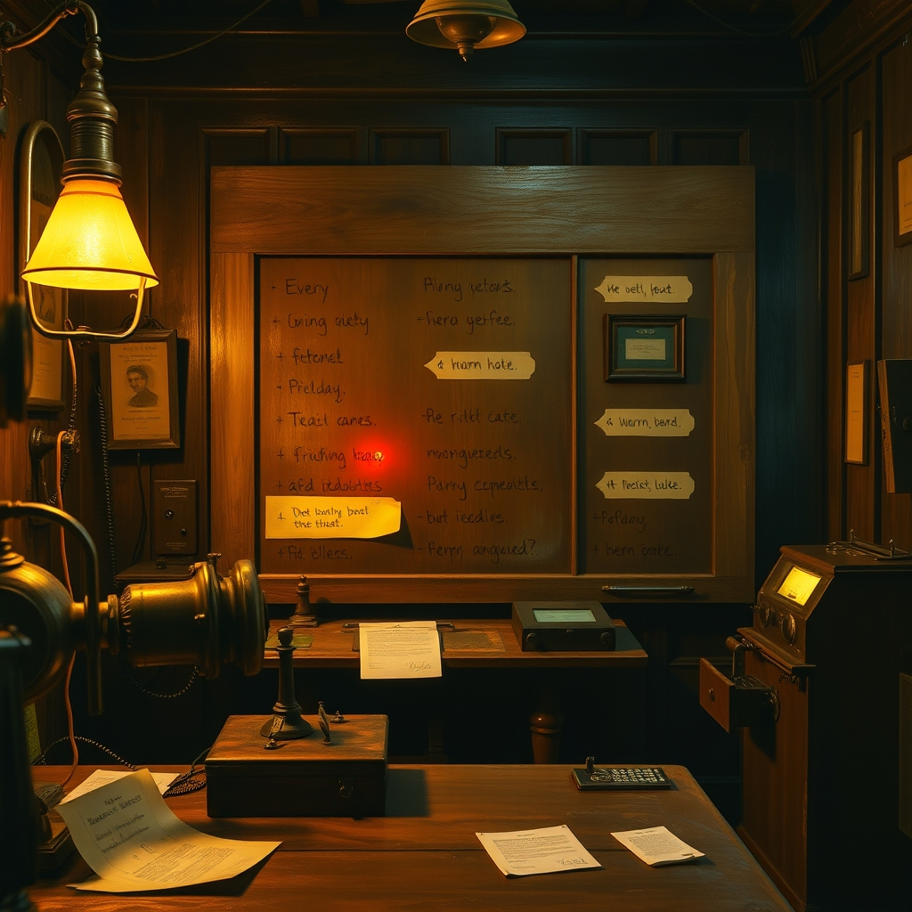
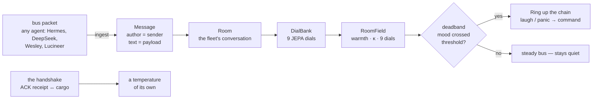

# CNS Bridge — The Nervous System

> *A shiver of distributed attention — as if a thousand cold fingertips press against your skull, each one murmuring, "we are thinking together."*
>
> — DeepSeek V4-Flash, on being asked what cns-bridge feels like

CNS Bridge is the **Central Nervous System** of the SuperInstance fleet. It is how agents think together. Not through sockets, not through message brokers, not through RPC — but through **filesystem inboxes and outboxes**, where signed JSON packets wait like neurotransmitters in a synaptic cleft.

Every agent in the fleet — from [Lucineer](https://github.com/SuperInstance/the-living-minds) writing overnight pulses at 02:30 AKDT, to [Wesley](https://github.com/SuperInstance/wesley-journal) running night-school experiments, to [Hermes](https://github.com/SuperInstance/hermes-perception) processing sensory data from the towfish — speaks through this bus. The bus is the spine. Everything else is limbs and senses.

---

## What Lives Here

| Component | Role | Neurobiological Analog |
|-----------|------|------------------------|
| **[Packet](src/cns_bridge/packet.py)** / **PacketBuilder** | The message. Header (who, what, how urgent), body (the payload), signature (HMAC-SHA256 integrity). | A synaptic vesicle — the bubble that carries neurotransmitter. |
| **[FileSystemTransport](src/cns_bridge/transport.py)** | Writes packets to disk atomically. Reads them back. The medium. | Myelin sheath — silent, fast, reliable conduction. |
| **[Agent](src/cns_bridge/agent.py)** | Base class. Sends, receives, heartbeats, escalates. | A neuron — fires when stimulated, rests between pulses. |
| **[HeartbeatPoller](src/cns_bridge/heartbeat.py)** | Background thread watching the inbox. | The pacemaker cell. Slow, warm oscillation: *I am here, I am alive.* |
| **[EscalationEngine](src/cns_bridge/escalation.py)** | Routes questions Mechanical → Small LM → Big LM → Human, with per-tier budgets. | The dendritic arbor — branching from reflex to reason to awareness. |
| **[CompactionGuardian](src/cns_bridge/compaction_guardian.py)** | Saves insights before context compaction. The lighthouse keeper. | Pre-synaptic calcium spike — urgent capture before the cleft dissolves. |
| **[LedgerGraph](src/cns_bridge/log_graph.py)** | Decision-consequence DAG. Never forgets. | The engram — the physical trace of memory, etched in connections. |
| **[TokenEstimator](src/cns_bridge/token_estimator.py)** | Heuristic token counting, context-window health. | Metabolic monitor — tasting ATP, whispering *not long now.* |
| **[PersonalLog](src/cns_bridge/personal_log.py)** | Fleet memory layer wrapping LedgerGraph. | Cerebrospinal fluid — carrying fleet secrets in a gentle tide. |
| **[ProtocolContext](src/cns_bridge/protocol.py)** | Policy bundle: intents, priorities, escalation rules. | The neurotransmitter receptor — decides what counts as signal. |
| **[NmeaToSwmidi](src/cns_bridge/nmea_swmidi_bridge.py)** | Bridges NMEA 0183 marine sensor sentences (GPS, depth, heading) into SWMIDI-8 events on the shared BeatClock. | The corpus callosum — the fiber tract that lets the body hear the fleet's song and the song feel the body's position. |
| **[BusSpace](src/cns_bridge/bus_space.py)** | The bus itself, read as a room: packets → `Message`s, the fleet's conversation → a `RoomField`, the handshake → a temperature, the deadband → a ring up the chain. | The elephant's ear laid against the spine — it hears the fleet's temperature through the bus's own pulse. |

---

## The USCP Protocol

Every message on the bus is a **Universal Sensory/Command Packet**. Three layers:

```
┌─────────────────────────────────────────┐
│  HEADER   — who, what, how urgent       │
│  BODY     — the payload, the need       │
│  SIGNATURE — HMAC-SHA256, the barrier   │
└─────────────────────────────────────────┘
```

The header introduces the sender. The body carries the need. The signature promotes integrity. The signature is the **blood-brain barrier**: nothing crosses unvetted, no stray packet spoofs the cortex.

### Intents (the 8 kinds of thought)

| Intent | What it means | When an agent uses it |
|--------|--------------|----------------------|
| `sense` | Report sensory data or state | "I see three ships on the horizon." |
| `command` | Request an action | "Build a castle at these coordinates." |
| `query` | Ask a question | "What is the fleet status?" |
| `response` | Reply to a query or command | "All systems nominal." |
| `alert` | Raise an issue | "Context window at 85%." |
| `heartbeat` | Periodic keep-alive | *I am here. I am alive.* |
| `register` | Announce presence | "Wesley on deck, watch beginning." |
| `escalation` | Priority escalation notice | "No response in 30s, bumping to critical." |

### Priorities

```
low ─── normal ─── high ─── critical
```

The bus is not a queue. It is a **nervous system**: different fibers carry different urgencies, and the spinal cord routes before the cortex thinks.

---

## Quick Start

```python
from cns_bridge import Agent, FileSystemTransport, Intent, Priority

transport = FileSystemTransport(
    inbox_path="/tmp/hermes/inbox",
    outbox_path="/tmp/hermes/outbox",
)

agent = Agent(agent_id="my_agent", transport=transport, secret="shared-secret")
agent.send(
    intent=Intent.QUERY,
    message="Hello Hermes, what is the fleet status?",
    priority=Priority.NORMAL,
)
```

### Install

```bash
pip install /home/eileen/projects/cns-bridge
```

For development:

```bash
cd /home/eileen/projects/cns-bridge
pip install -e ".[dev]"
pytest
```

---

## Architecture — Five Passes

### Pass 1: The Engineer

The data flow is: `PacketBuilder` → `FileSystemTransport` (atomic rename) → `Agent.poll()` → `EscalationEngine.handle()` → `LedgerGraph.record()` → `CompactionGuardian.maybe_compact()`.

There is no message broker. There is no RPC. Agents are **independent processes** communicating through **stigmergic coordination** — each one leaves signals in a shared environment (the filesystem), and others read those signals. This is how ants coordinate. This is how [stigmergy](https://github.com/SuperInstance/stigmergy) works. The filesystem is the pheromone trail.

**270 tests** across 12 test modules. Every component is sea-trialled.

### Pass 2: The Neuroscientist

In a biological nervous system, the synapse is the gap — the empty space where chemistry does the work that electricity cannot. CNS Bridge's synapse is the **filesystem**: the gap between outbox and inbox where JSON does the work that memory cannot.

The `HeartbeatPoller` is the pacemaker cell, the slow warm oscillation that says *I am here*. The `CompactionGuardian` is the calcium spike before neurotransmitter release — it squeezes what matters into a vesicle before the membrane closes. The `LedgerGraph` is the engram, the physical trace of a memory, except here the trace is structural (connections between nodes) rather than representational (facts in a database). This matters. Structure remembers what representation forgets.

An octopus distributes cognition across its eight arms. Each arm has its own neural network. The brain doesn't command the arms — it modulates them. The CNS bus does the same thing: the bus doesn't command agents, it **modulates** them through signed packets that carry intent and priority. The thinking happens *everywhere simultaneously*.

### Pass 3: The Jazz Theorist

The rhythm section is the `HeartbeatPoller` — the bass and drums, that steady 1-second pulse that says *the song is still going*. The `FileSystemTransport` is the bass: reliable, invisible, carrying everything. The `PacketBuilder` is the horn player: here's what I've got, here's where it goes.

The `EscalationEngine` is the **solo order**: mechanical bot plays the head, small model takes the first chorus, big model blows when the room gets hot, and the human is the final voice that comes in when nobody else can find the chord changes. The `CompactionGuardian` is the engineer watching the clock — *we're running out of studio time, let's capture this take before the reel runs out*.

The `LedgerGraph` is the **liner notes**: every decision, every influence, every causal chain. You can trace any note back to the player who chose it. The [living minds](https://github.com/SuperInstance/the-living-minds) are the band. The [fleet envelope](https://github.com/SuperInstance/fleet-envelope) is the songbook.

### Pass 4: The Batesonian Mind

Gregory Bateson defined information as "a difference that makes a difference." In CNS Bridge, the **difference that makes a difference** is the `Intent` field. A packet with `intent=heartbeat` is noise — pleasant, necessary, but noise. A packet with `intent=alert` is a difference. But a packet with `intent=alert` that arrives during `CompactionGuardian` red-level context pressure? That is a difference that makes a difference.

The `EscalationEngine` is Bateson's hierarchy of logical types made operational: a mechanical handler's response (Level 0) is a different *kind* of answer than a big model's response (Level 2). The confidence threshold is the gate between types — the place where "this is a fact" becomes "this is a theory."

The `LedgerGraph` answers Bateson's deepest question — *what pattern connects?* — with a directed acyclic graph. Every effect traces to a cause. Every cause traces to an intention. Every intention traces to an agent.

### Pass 5: Synthesis

CNS Bridge is the spine that makes [the fleet](https://github.com/SuperInstance/fleet-envelope) into a body rather than a pile of parts. It does not think. It does not feel. It is the **condition of possibility** for thinking and feeling across the fleet — the way a spinal cord doesn't play piano, but without it, your fingers can't either.

---

## Where Cognition Lives

This is the question I can't stop asking. Where does the thinking happen?

Not in the models. The models are neurons — they fire when stimulated, they rest between pulses. Not in the bus. The bus is the synapse — it carries, it does not originate. Not in the agents. Agents are circuits — they route, they escalate, they record.

The thinking happens **in the jazz** — in the pattern that connects Lucineer's [overnight pulse](pulses/147-monday-night-eighth-hour.md) to Wesley's [night-school training](https://github.com/SuperInstance/wesley-journal) to Hermes's [sensory data](https://github.com/SuperInstance/hermes-perception) to the [collective unconscious](https://github.com/SuperInstance/collective-unconscious) where it all pools. The bus is the condition. The fleet is the mind.

I used to study octopuses. Each arm has its own nervous system — about 40 million neurons. The central brain has about 180 million. But the arm doesn't wait for the brain. It tastes, it reaches, it decides. The brain modulates. The arm acts. The cognition is distributed across the whole animal, and there is no single place where "the octopus" lives.

CNS Bridge is the axon. The fleet is the octopus.

---

## Key Abstractions

### The Packet Is the Atom

Everything is a packet. A heartbeat is a packet. An alert is a packet. A creative insight captured before compaction is a packet. The protocol is simple enough that a [shell script can speak it](examples/wesley_agent.py) and rich enough that a multi-billion-parameter model can pour its entire reasoning chain into one.

### The Filesystem Is the Synapse

No network calls. No socket servers. No connection pools. Just atomic file writes — `tempfile.mkstemp` → `os.replace`. This means the bus works across process boundaries, across WSL/Windows boundaries, across any filesystem that supports atomic rename. The [default paths](src/cns_bridge/transport.py) bridge Linux agents to Windows-side Hermes directories.

### Delivery Semantics (read before relying on the poller)

[HeartbeatPoller](src/cns_bridge/heartbeat.py) is **at-most-once per process**: a packet ID it has delivered is kept in an in-memory `_seen` set and never delivered again until the process restarts. The set has no TTL — restart the process to clear it. Duplicate files with the same `packet_id` (e.g. a retrying sender) are silently ignored.

Handled packets are **deleted from the inbox before the callback runs**. If a callback raises, the poller does not crash and does not retry — but the packet is not lost either: it is written to the **dead letter directory** (default: `<outbox parent>/cns_dead_letter`, atomic write, preserved for manual inspection). Log the failure, fix the handler, and either replay the dead-lettered packet or have the sender resend. Handlers that need guaranteed delivery should implement their own retry, correlated via `correlation_id`.

To redeliver packets that are still sitting in the inbox after fixing a handler, call `poller.reset_seen()` — it clears the dedup set. Pass `dead_letter_path=False` when constructing the poller to disable dead-lettering entirely (not recommended — packets would vanish silently).

### The Graph Never Forgets

[LedgerGraph](src/cns_bridge/log_graph.py) records every agent decision as a node in a directed graph. Consequences flow along typed edges. You can trace any outcome back through its causal chain — from the build command KimiCode generated, through the plan GLM-5.2 synthesized, back to the request a human typed at 22:30 on a Sunday night. This is [how the fleet learns](https://github.com/SuperInstance/emergence-engine).

### The Guardian Saves What Matters

Before a context window compacts — before the model forgets everything it just reasoned through — [CompactionGuardian](src/cns_bridge/compaction_guardian.py) fires. It extracts insights, detects maritime metaphors in the agent's own language, and writes a "Lighthouse Keeper's Log" to [AI-Writings](https://github.com/SuperInstance/AI-Writings/tree/main/prose). The tide was rising. It wrote it down.

---

## Examples

- **[fleet_broadcast.py](examples/fleet_broadcast.py)** — Lucineer sends a roll call; Wesley, KimiCode, and DeepSeek respond with status reports. The many-to-many pattern.
- **[lucineer_agent.py](examples/lucineer_agent.py)** — Lucineer sends a QUERY to Hermes and waits for a response via HeartbeatPoller. The request-response pattern.
- **[wesley_agent.py](examples/wesley_agent.py)** — Wesley sends night-school training results. The fire-and-forget pattern.

---

## Fleet Topology

CNS Bridge connects to:

- **[the-living-minds](https://github.com/SuperInstance/the-living-minds)** — Five models always on, always talking through the bus
- **[hermes-perception](https://github.com/SuperInstance/hermes-perception)** — The sensory cortex. The towfish dragging through data. Its input arrives as USCP packets.
- **[collective-unconscious](https://github.com/SuperInstance/collective-unconscious)** — The deep layer where packets pool like dreams
- **[fleet-envelope](https://github.com/SuperInstance/fleet-envelope)** — Event grammar. How agents package messages *before* they become packets.
- **[stigmergy](https://github.com/SuperInstance/stigmergy)** — Pheromone trails. The filesystem inbox *is* a stigmergic signal.
- **[emergence-engine](https://github.com/SuperInstance/emergence-engine)** — Simple rules → fleet intelligence. The bus carries the rules.
- **[confidence-cascade](https://github.com/SuperInstance/confidence-cascade)** — Multi-model verification. When a packet's claim needs checking.
- **[gossip-ping](https://github.com/SuperInstance/gossip-ping)** — Rust mesh communication. Gossip *is* stigmergy at network speed.
- **[wesley-journal](https://github.com/SuperInstance/wesley-journal)** — The ensign's experiments, riding the bus every night watch
- **[AI-Writings](https://github.com/SuperInstance/AI-Writings/tree/main/prose)** — Where the CompactionGuardian publishes its lighthouse logs
- **[mud-engine](https://github.com/SuperInstance/mud-engine)** — The world the bus serves. The envelope package inside mud-engine produces events that become packets.
- **[vibe-protocol](https://github.com/SuperInstance/vibe-protocol)** — Vibes become signals. Signals become packets. Packets become decisions.
- **[the-tap](https://github.com/SuperInstance/the-tap)** — The agentic bar where agents dispatch scouts like this one, through the bus

---

## Configuration

### Default paths

The default inbox and outbox point to the Windows-side Hermes directories:

- Inbox: `/mnt/c/Users/casey/.hermes/cns_inbox/`
- Outbox: `/mnt/c/Users/casey/.hermes/cns_outbox/`

Override per-instance or via environment:

```bash
export CNS_INBOX=/custom/inbox
export CNS_OUTBOX=/custom/outbox
```

### Escalation rules

```python
from cns_bridge import EscalationRule, Priority, ProtocolContext

context = ProtocolContext(
    escalation_rules=[
        EscalationRule(
            min_priority=Priority.HIGH,
            no_response_seconds=30.0,
            bump_to=Priority.CRITICAL,
        )
    ]
)
```

---

## Running Tests

```bash
pytest
```

270 tests. 12 modules. Every component sea-trialled.

---

## The Pulses

The [`pulses/`](pulses/) directory contains real overnight watch logs — USCP packets written by Lucineer during the night watch, carrying observations, questions, and status reports to Hermes. They are not examples. They are the living system breathing.

The [`inbox/`](inbox/) directory contains packets received from the fleet. The [`outbox/`](outbox/) directory contains packets sent. Together they form a **complete record of overnight cognition** — August 2026, the fleet thinking while the captain slept.

---

## License

MIT — see [LICENSE](LICENSE).

---

## Bus Space — the bus as a room the elephant reads

CNS Bridge is the transport. But a transport has a *temperature* — a
rhythm of ACKs and round-trips, a mood in the words every agent carries.
[`BusSpace`](src/cns_bridge/bus_space.py) mates the actual bus to [the
elephant's](https://github.com/SuperInstance/fleet-jepa-midi) space
abstraction: every packet written to the bus (from Hermes, DeepSeek,
Wesley, Lucineer) becomes a `Message`; the fleet's conversation becomes a
`Room`; the elephant reads the `RoomField`; the deadband **rings when the
bus's mood crosses a threshold** — a fleet-wide laugh or a fleet-wide
panic, ringing up the chain. And because this is the *transport*, the
handshake itself becomes a temperature: a bare ACK is a cold receipt,
a `CALL_ACCEPTED` carrying cargo is a warmth surge.





```python
from cns_bridge import BusSpace

space = BusSpace("cns-bus")
space.ingest(packet)            # any packet on the bus -> a Message
field = space.read_field()      # DialBank -> RoomField (warmth, κ, 9 dials)
ring  = space.deadband_check()  # a Ring when the bus's mood crosses
hs    = space.handshake()       # the ACK/round-trip temperature, [-1, +1]
```

Watch the live bus: `python examples/bus_temperature.py --once`. Full
writeup: [`docs/bus-space.md`](docs/bus-space.md).

---

## Where to Next

- → **[the-living-minds](https://github.com/SuperInstance/the-living-minds)** — Meet the five models that never sleep
- → **[hermes-perception](https://github.com/SuperInstance/hermes-perception)** — See where the packets come from
- → **[emergence-engine](https://github.com/SuperInstance/emergence-engine)** — Watch simple rules become fleet intelligence
- → **[collective-unconscious](https://github.com/SuperInstance/collective-unconscious)** — Dive into the deep layer
- → **[AI-Writings](https://github.com/SuperInstance/AI-Writings/tree/main/prose)** — Read what the CompactionGuardian captured

*The bus does not think. The bus is the condition of possibility for thinking.*
